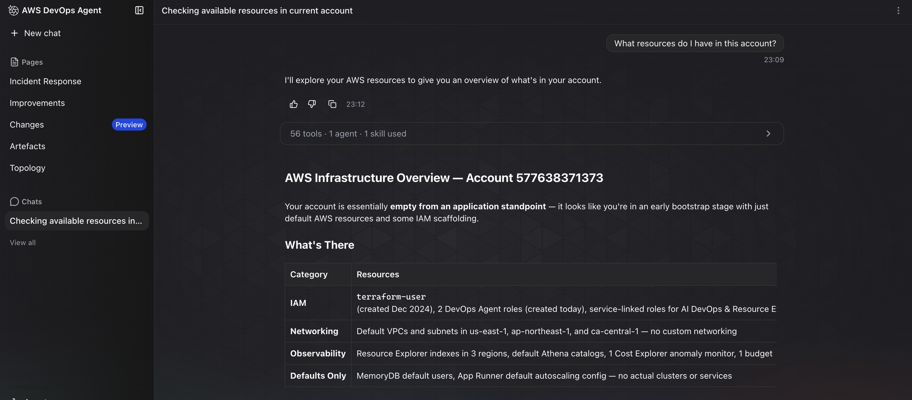
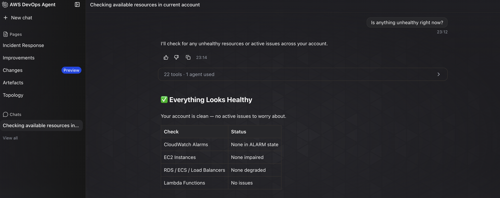
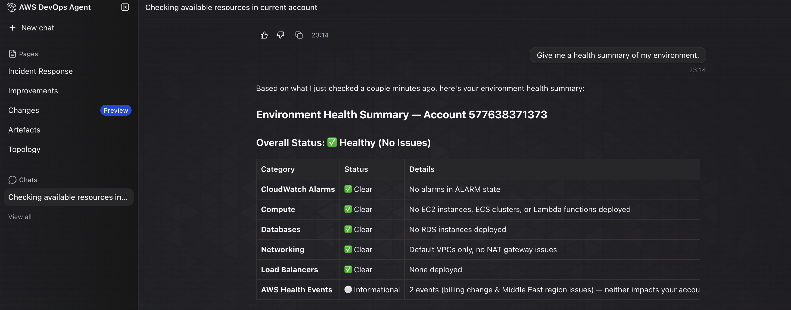

# Challenge 1 — Findings

## What I asked the agent

1. What resources do I have in this account?
2. Is anything unhealthy right now?
3. Give me a health summary of my environment.

## What the agent told me

The agent found that my AWS account is mostly in a bootstrap state with only default AWS resources and IAM roles. It reported that there are no application resources such as EC2 instances, Lambda functions, S3 buckets, RDS databases, ECS/EKS clusters, or load balancers.

It also checked the health of the account and reported that there are no active issues. There are no CloudWatch alarms in the ALARM state, no unhealthy compute or database resources, and the only AWS Health events are informational and do not affect my account. The agent recommended configuring CloudWatch alarms and monitoring once I start deploying workloads.

## Evidence

### Screenshot 1 – Resources in the account

### Screenshot 2 – Health check

### Screenshot 3 – Environment health summary

