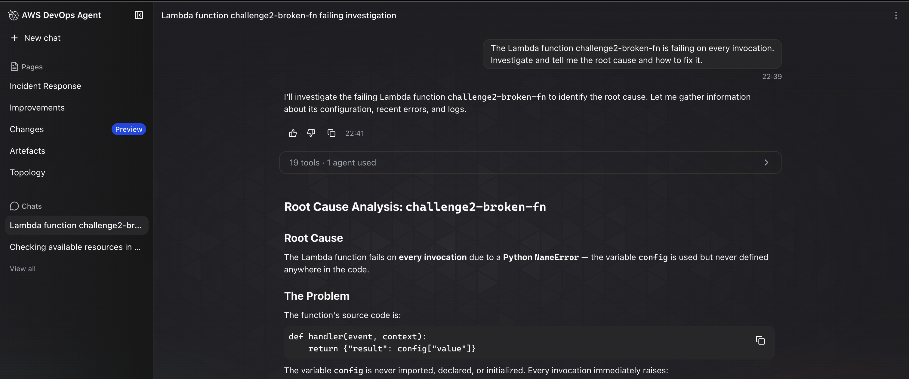
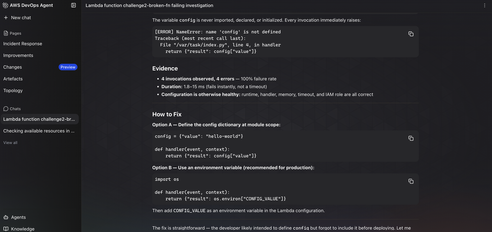
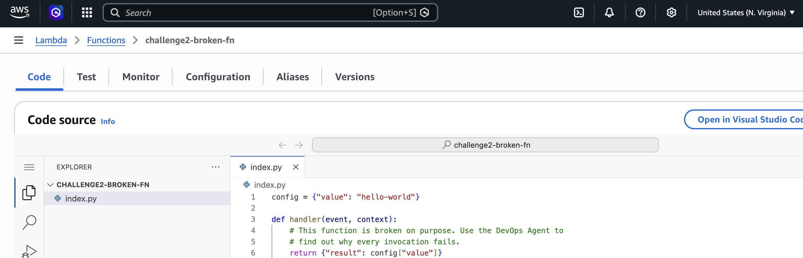
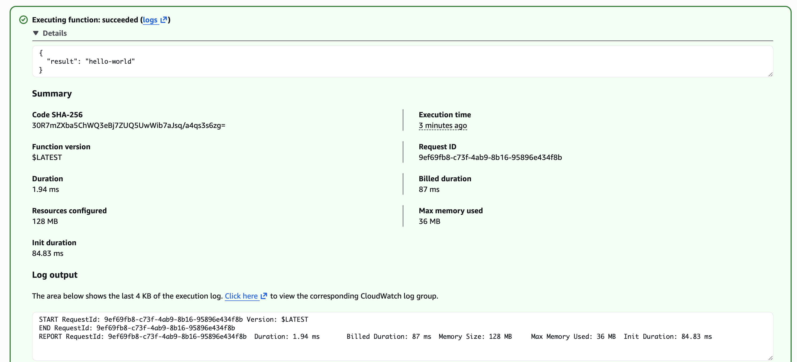

# Challenge 2 — Findings

## Root cause
The Lambda function failed on every invocation because the handler returned `config["value"]`, but `config` was never defined in the function code. That caused an immediate Python `NameError` before the function could produce a response.

## Fix applied
I updated the Lambda source by adding a module-level `config = {"value": "hello-world"}` definition above the handler. That gave the function the missing value it expected, and the next test invocation returned `{"result": "hello-world"}` successfully.

## Evidence
- [x] Screenshot 1: the agent identified the undefined `config` variable as the root cause
- [x] Screenshot 2: the agent showed the exact `NameError` and recommended defining `config`
- [x] Screenshot 3: the Lambda code was updated with the missing `config` dictionary
- [x] Screenshot 4: the function test succeeded and returned `{"result": "hello-world"}`

### Screenshot 1 — Agent root-cause finding

### Screenshot 2 — Agent error details and fix recommendation

### Screenshot 3 — Lambda code fix applied

### Screenshot 4 — Successful Lambda test

